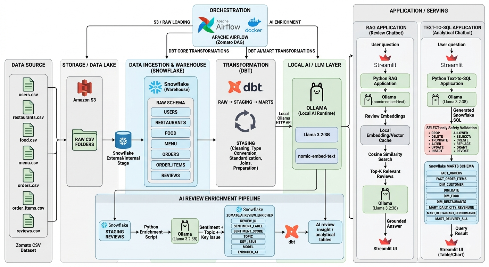

# 🍽️ Zomato End-to-End Data Engineering & AI Pipeline

An end-to-end Data Engineering and AI project that processes Zomato restaurant, customer, menu, order, and review data through a modern cloud data pipeline.

The project uses **Amazon S3** as the raw data lake, **Snowflake** as the cloud data warehouse, **Apache Airflow** for orchestration, and **dbt** for data transformation and dimensional modeling.

An additional local AI layer powered by **Ollama** and **Llama 3.2:3B** enriches restaurant reviews with sentiment, topics, and key issues. The enriched data is then used by AI-powered **RAG** and **Text-to-SQL** Streamlit applications.

---

## 📌 Project Overview

This project demonstrates a complete modern data engineering workflow:

**Raw Zomato CSV Data → Amazon S3 → Snowflake → dbt → Snowflake Marts → AI Enrichment → Streamlit Applications**

The pipeline handles large-scale Zomato datasets including:

- Users
- Restaurants
- Food
- Menu
- Orders
- Order Items
- Reviews

The project combines traditional Data Engineering with Generative AI to provide both structured analytics and natural-language interaction with the data warehouse.

---

## 🏗️ Architecture

The complete architecture of the project is shown below.



### Architecture Layers

The architecture is divided into the following major layers:

1. **Data Source**
2. **Storage / Data Lake**
3. **Data Ingestion & Warehouse**
4. **Transformation**
5. **Local AI / LLM Layer**
6. **AI Review Enrichment**
7. **Application / Serving Layer**

---

# 🔄 End-to-End Data Flow

```text
Zomato CSV Dataset
        │
        ▼
   Amazon S3
        │
        ▼
 Snowflake External/Internal Stage
        │
        ▼
   Snowflake RAW
      Schema
        │
        ▼
      dbt
        │
        ├── STAGING
        │
        ▼
      MARTS
        │
        ├───────────────► Analytics
        │
        ▼
 AI Review Enrichment
        │
        ▼
 Ollama / Llama 3.2:3B
        │
        ▼
 Enriched Review Data
        │
        ├───────────────► RAG Application
        │
        └───────────────► Text-to-SQL Application
```

---

# 🛠️ Technology Stack

| Technology | Purpose |
|---|---|
| Python | Data processing, AI enrichment and application backend |
| SQL | Data querying and warehouse transformations |
| Amazon S3 | Raw data lake / CSV storage |
| Snowflake | Cloud data warehouse |
| Apache Airflow | Pipeline orchestration |
| Docker | Containerization and Airflow environment |
| dbt | Data transformation and dimensional modeling |
| Ollama | Local LLM runtime |
| Llama 3.2:3B | Local language model |
| nomic-embed-text | Text embedding generation |
| Streamlit | AI application and dashboard interface |
| Git / GitHub | Version control and project hosting |
| Git LFS | Large dataset management |

---

# 📂 Dataset

The project uses Zomato-related CSV datasets:

```text
data/
├── food.csv
├── menu.csv
├── order_items.csv
├── orders.csv
├── restaurant.csv
├── reviews.csv
└── users.csv
```

The dataset contains approximately **2.3 GB** of raw CSV data.

The largest datasets are:

```text
orders.csv          ~1.3 GB
order_items.csv     ~911 MB
menu.csv             ~63 MB
restaurant.csv       ~45 MB
reviews.csv          ~25 MB
food.csv             ~17 MB
users.csv            ~11 MB
```

Large CSV files are managed using **Git LFS**.

Sensitive credential files such as:

```text
data/creds
.env
```

are not included in the repository.

---

# ☁️ Data Lake - Amazon S3

Amazon S3 is used as the raw data lake layer.

The raw CSV files are organized into separate folders before being loaded into Snowflake.

```text
Amazon S3
│
└── RAW CSV FOLDERS
    ├── users/
    ├── restaurants/
    ├── food/
    ├── menu/
    ├── orders/
    ├── order_items/
    └── reviews/
```

This provides a centralized raw storage layer before warehouse ingestion.

---

# ❄️ Snowflake Data Warehouse

Snowflake acts as the central cloud data warehouse.

The raw data is loaded into the `RAW` schema before transformation.

### RAW Schema

The main raw tables include:

```text
RAW
├── USERS
├── RESTAURANTS
├── FOOD
├── MENU
├── ORDERS
├── ORDER_ITEMS
└── REVIEWS
```

Snowflake stages are used to load the raw CSV files into the warehouse.

---

# 🔄 dbt Transformation Layer

dbt is used to transform the raw Snowflake data into clean and analytics-ready datasets.

The transformation flow is:

```text
RAW
 │
 ▼
STAGING
 │
 │ Cleaning
 │ Type Conversion
 │ Standardization
 │ Data Preparation
 ▼
MARTS
 │
 ▼
Analytics
```

## Staging Layer

The staging layer performs operations such as:

- Data cleaning
- Column standardization
- Data type conversion
- Null handling
- Data preparation
- Source modeling

Example:

```text
stg_restaurants
```

---

# ⭐ Marts Layer

The marts layer contains analytics-ready dimensional and fact models.

Major analytical models include:

```text
FACT_ORDERS
FACT_ORDER_ITEMS

DIM_CUSTOMER
DIM_DATE
DIM_FOOD
DIM_RESTAURANTS

MART_DAILY_CITY_REVENUE
MART_RESTAURANT_PERFORMANCE
MART_DELIVERY_SLA
```

The marts layer is designed to support downstream analytics and AI applications.

---

# ⚙️ Apache Airflow Orchestration

Apache Airflow is used to orchestrate the end-to-end pipeline.

The Airflow environment runs using Docker.

The pipeline can coordinate tasks such as:

```text
Data Availability
      │
      ▼
Raw Data Loading
      │
      ▼
Snowflake Processing
      │
      ▼
dbt Transformations
      │
      ▼
AI Review Enrichment
      │
      ▼
Analytics / Applications
```

Airflow provides:

- DAG-based workflow orchestration
- Task dependency management
- Scheduling
- Monitoring
- Retry handling
- Execution logs

---

# 🐳 Docker

Docker is used to provide a consistent runtime environment for the pipeline and Airflow services.

This helps isolate project dependencies and makes the orchestration environment reproducible.

---

# 🤖 AI Review Enrichment Pipeline

The project includes an AI-powered review enrichment pipeline.

Restaurant reviews are processed using a local LLM instead of sending review data to an external LLM API.

### AI Flow

```text
Snowflake STAGING_REVIEWS
          │
          ▼
 Python Enrichment Script
          │
          ▼
 Ollama
          │
          ▼
 Llama 3.2:3B
          │
          ▼
 Sentiment
 Topic
 Sentiment Score
 Key Issue
          │
          ▼
 Enriched Review Data
          │
          ▼
 Snowflake
          │
          ▼
 dbt
          │
          ▼
 AI Review Insight / Analytics Tables
```

---

# 🧠 Local LLM Layer

The AI layer runs locally using:

### Ollama

Ollama provides the local LLM runtime.

### Llama 3.2:3B

The model is used for review analysis and natural-language processing.

### nomic-embed-text

The embedding model is used to generate vector representations of restaurant reviews for semantic search.

The local AI architecture helps avoid sending review content to an external LLM service.

---

# 🔎 RAG Review Chatbot

The project includes a Retrieval-Augmented Generation (RAG) application for restaurant reviews.

The application is built using Streamlit.

### RAG Flow

```text
User Question
      │
      ▼
Streamlit
      │
      ▼
Python RAG Application
      │
      ▼
nomic-embed-text
      │
      ▼
Review Embeddings
      │
      ▼
Local Embedding / Vector Cache
      │
      ▼
Cosine Similarity Search
      │
      ▼
Top-K Relevant Reviews
      │
      ▼
Llama 3.2:3B
      │
      ▼
Grounded Answer
      │
      ▼
Streamlit UI
```

The RAG system retrieves the most relevant reviews before generating an answer.

This allows the LLM to answer questions using retrieved restaurant review context.

---

# 💬 Text-to-SQL Application

The project also includes a Text-to-SQL application.

Users can ask analytical questions in natural language.

Example:

```text
"Which restaurants generated the highest revenue?"
```

The application converts the natural-language question into SQL and executes the generated query against Snowflake.

### Text-to-SQL Flow

```text
User Question
      │
      ▼
Streamlit
      │
      ▼
Python Text-to-SQL Application
      │
      ▼
Ollama
      │
      ▼
Llama 3.2:3B
      │
      ▼
Generated Snowflake SQL
      │
      ▼
SQL Safety Validation
      │
      ▼
Snowflake MARTS
      │
      ▼
Query Result
      │
      ▼
Streamlit UI
```

---

# 🔐 SQL Safety Validation

Because the Text-to-SQL application generates SQL dynamically, a validation layer is used before executing generated queries.

The application restricts operations to allowed analytical SQL operations.

Allowed operations include:

```text
SELECT
```

and controlled analytical statements.

Destructive operations such as:

```text
DROP
DELETE
TRUNCATE
ALTER
UPDATE
INSERT
CREATE
REPLACE
GRANT
```

are blocked by the validation layer.

This helps prevent accidental or malicious modification of warehouse data.

---

# 📊 Analytics Capabilities

The Snowflake marts provide data that can support analytical questions such as:

- Which restaurants generate the highest revenue?
- Which cities generate the most revenue?
- Which restaurants have the highest ratings?
- What are the most popular food items?
- What is the average order value?
- Which restaurants have the best delivery performance?
- What are the most common customer complaints?
- What is the sentiment distribution of restaurant reviews?

---

# 📁 Project Structure

```text
zomato-data-pipeline/
│
├── airflow/
│   ├── dags/
│   ├── logs/
│   └── ...
│
├── ai/
│   ├── review enrichment
│   ├── RAG application
│   ├── Text-to-SQL application
│   └── ...
│
├── data/
│   ├── food.csv
│   ├── menu.csv
│   ├── order_items.csv
│   ├── orders.csv
│   ├── restaurant.csv
│   ├── reviews.csv
│   └── users.csv
│
├── zomato/
│   ├── models/
│   │   ├── staging/
│   │   └── marts/
│   ├── dbt_project.yml
│   └── ...
│
├── .gitattributes
├── docker-compose.yml
└── README.md
```

> The exact directory contents may vary depending on the local development environment.

---

# 🚀 Pipeline Workflow

The complete pipeline follows these stages:

### Step 1 - Raw Data

Zomato CSV datasets are collected and organized.

### Step 2 - Data Lake

Raw CSV files are stored in Amazon S3.

### Step 3 - Snowflake Ingestion

The raw files are loaded into Snowflake using stages and `COPY INTO`.

### Step 4 - Raw Warehouse Layer

The data is stored in the Snowflake `RAW` schema.

### Step 5 - dbt Staging

dbt cleans and standardizes the raw data.

### Step 6 - dbt Marts

Analytics-ready fact and dimension tables are created.

### Step 7 - AI Review Enrichment

Restaurant reviews are processed using the local Ollama LLM.

### Step 8 - AI Analytics

Enriched review information is stored back in Snowflake and transformed through dbt.

### Step 9 - AI Applications

Streamlit applications provide:

- Review-based RAG
- Natural-language Text-to-SQL analytics

---

# 🧪 Data Quality & Testing

dbt testing is used to validate transformed datasets.

Typical data quality checks include:

- Not-null validation
- Unique key validation
- Source validation
- Model validation
- Relationship validation

The project also uses SQL validation for dynamically generated Text-to-SQL queries.

---

# 🔧 Installation & Setup

## 1. Clone the Repository

```bash
git clone https://github.com/AsmeerFarooqi/zomato_etl_pipeline.git
cd zomato_etl_pipeline
```

---

## 2. Install Git LFS

The repository uses Git LFS for large CSV datasets.

Install Git LFS and initialize it:

```bash
git lfs install
```

Then pull LFS files:

```bash
git lfs pull
```

---

## 3. Python Environment

Create a virtual environment:

```bash
python -m venv venv
```

Activate it on Windows:

```bash
venv\Scripts\activate
```

Install required Python dependencies:

```bash
pip install -r requirements.txt
```

---

## 4. Configure Environment Variables

Sensitive credentials should be stored in `.env` files and should never be committed to GitHub.

Example:

```env
SNOWFLAKE_ACCOUNT=your_account
SNOWFLAKE_USER=your_username
SNOWFLAKE_PASSWORD=your_password
SNOWFLAKE_WAREHOUSE=your_warehouse
SNOWFLAKE_DATABASE=ZOMATO
SNOWFLAKE_SCHEMA=RAW
SNOWFLAKE_ROLE=your_role
```

For S3:

```env
AWS_ACCESS_KEY_ID=your_access_key
AWS_SECRET_ACCESS_KEY=your_secret_key
AWS_DEFAULT_REGION=your_region
```

Never commit real credentials.

---

# ❄️ Snowflake Setup

Create the required database and schemas in Snowflake.

Example:

```sql
CREATE DATABASE ZOMATO;

CREATE SCHEMA ZOMATO.RAW;
CREATE SCHEMA ZOMATO.STAGING;
CREATE SCHEMA ZOMATO.MARTS;
```

Create the required stage and file format according to the project configuration.

Raw files can then be loaded using:

```sql
COPY INTO ZOMATO.RAW.<TABLE_NAME>
FROM @ZOMATO_RAW_STAGE/<FOLDER_NAME>/
ON_ERROR = CONTINUE;
```

---

# 🔄 Running dbt

Navigate to the dbt project:

```bash
cd zomato
```

Check the dbt connection:

```bash
dbt debug
```

Run staging models:

```bash
dbt run --select staging
```

Run marts:

```bash
dbt run --select marts
```

Run tests:

```bash
dbt test
```

Generate documentation:

```bash
dbt docs generate
```

---

# 🐳 Running Airflow with Docker

Start Docker Desktop first.

Then run:

```bash
docker compose up -d
```

Check running containers:

```bash
docker compose ps
```

View logs:

```bash
docker compose logs
```

Stop the environment:

```bash
docker compose down
```

---

# 🤖 Running the Local AI Layer

Make sure Ollama is installed and running.

Pull the required models:

```bash
ollama pull llama3.2:3b
```

For embeddings:

```bash
ollama pull nomic-embed-text
```

Verify available models:

```bash
ollama list
```

The AI enrichment scripts can then communicate with the local Ollama runtime.

---

# 🌐 Running Streamlit Applications

Start the Streamlit application using the project's configured entry point.

Example:

```bash
streamlit run app.py
```

The application provides interfaces for:

### Review RAG Chatbot

Ask questions about restaurant reviews using semantic retrieval.

### Text-to-SQL Chatbot

Ask analytical questions in natural language and receive results from Snowflake.

---

# 🔒 Security

Security was considered throughout the project.

The following should never be committed:

```text
.env
credentials
private keys
AWS credentials
Snowflake passwords
API keys
```

Sensitive files are excluded using `.gitignore`.

Large datasets are managed separately using Git LFS.

---

# 📈 Key Engineering Concepts Demonstrated

This project demonstrates practical experience with:

- Data Engineering
- ETL / ELT pipelines
- Data Lakes
- Cloud Data Warehousing
- Amazon S3
- Snowflake
- Apache Airflow
- Docker
- dbt
- SQL
- Python
- Dimensional Modeling
- Fact and Dimension Tables
- Data Transformation
- Data Quality
- Generative AI
- Local LLMs
- Ollama
- RAG
- Text Embeddings
- Semantic Search
- Text-to-SQL
- SQL Safety Validation
- Streamlit
- Git
- Git LFS

---

# 🎯 Project Goals

The main goals of this project are:

1. Build an end-to-end modern data engineering pipeline.
2. Ingest large-scale raw data into a cloud data warehouse.
3. Transform raw data into analytics-ready models.
4. Automate workflows using Airflow.
5. Use dbt for modular and maintainable transformations.
6. Enrich restaurant reviews using a local LLM.
7. Build a RAG-based review chatbot.
8. Build a natural-language Text-to-SQL analytics application.
9. Provide secure and controlled access to warehouse data.

---

# 🚀 Future Improvements

Potential improvements include:

- CI/CD for dbt and Airflow
- Automated data quality monitoring
- Cloud deployment of the AI applications
- Vector database integration
- Improved RAG evaluation
- LLM response evaluation
- Pipeline monitoring and alerting
- Incremental dbt models
- Snowflake cost optimization
- Automated schema evolution
- More advanced analytics dashboards

---

# 👨‍💻 Author

**Asmeer Farooqi**

Data Engineering / Python / SQL / Cloud Data Platforms

### Technologies

```text
Python
SQL
Snowflake
AWS S3
Apache Airflow
Docker
dbt
Ollama
Llama 3.2:3B
Streamlit
Git
Git LFS
```

---

# ⭐ Project

If you find this project useful, consider giving the repository a ⭐ on GitHub.
